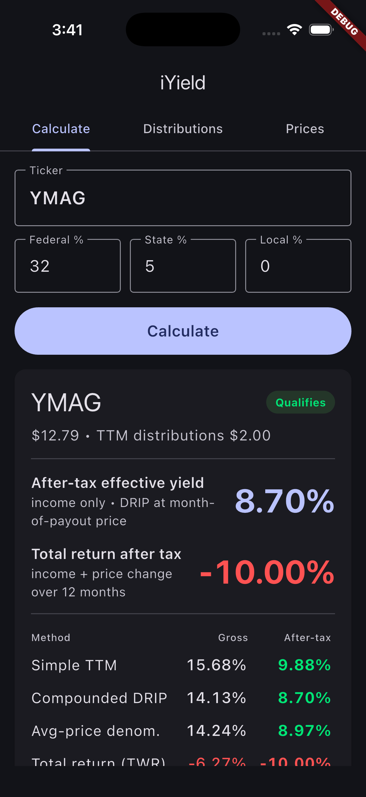
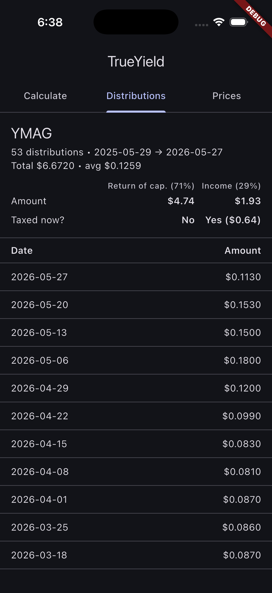
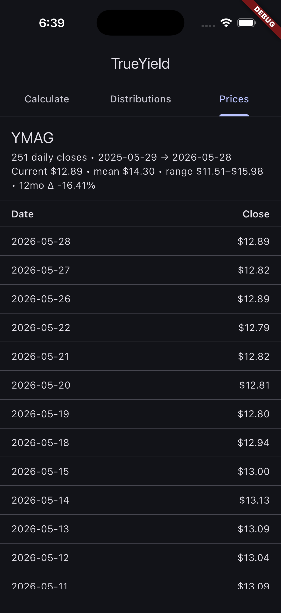

# iYield

A Flutter mobile app that answers a single question: **for this ticker, what is my actual after-tax yield over the last 12 months?**

Given a stock or ETF symbol plus your marginal federal, state, and local tax rates, iYield pulls trailing-12-month distribution and price data from Yahoo Finance and shows four different yield views side-by-side, so you can see how much the "headline yield" depends on how it's measured.

## Screenshots

Captured on iOS 26 simulator at 1206×2622 (iPhone 17). Inputs: `YMAG`, federal 32, state 5, local 0.

<table>
<tr>
<td width="33%" align="center"><b>Calculate</b><br/><sub>Four yield views, gross + after-tax</sub></td>
<td width="33%" align="center"><b>Distributions</b><br/><sub>Every payout in the last 12 months</sub></td>
<td width="33%" align="center"><b>Prices</b><br/><sub>Month-end closes used by the math</sub></td>
</tr>
<tr>
<td></td>
<td></td>
<td></td>
</tr>
</table>

The Calculate tab leads with the two numbers a yield-investor actually needs to see: **After-tax effective yield (compounded DRIP) 8.70%** in indigo, and **Total return after tax −10.00%** in red. Underneath, the full grid of gross vs. after-tax for all four methods, with after-tax bold and color-coded by sign. The story: YMAG's headline TTM yield is **15.68%**, but reinvesting at each month's actual price drags it to **14.13%** (DRIP), and once you include the **−16.13%** price decline visible on the Prices tab, total return is **−6.27% gross / −10.00% after-tax**. The "yield" is real but the share-price drop more than ate it.

## What it shows

For a ticker like `YMAG` at 32% federal, 5% state, 0% local:

| View | Formula | What it captures |
|---|---|---|
| **Simple TTM** | `sum(dist) / current_price` | The headline number Yahoo and Morningstar display. |
| **Compounded (DRIP)** | `∏(1 + d_t / P_t) − 1` | What you would have actually earned reinvesting each distribution at the price on the day it was paid. |
| **Average-price denominator** | `sum(dist) / mean(monthly closes)` | A simple correction for when the current price has moved a lot from where it was over the year. |
| **Total return (TWR)** | `∏((P_{t+1} + d_t) / P_t) − 1` | True total return, including price change. Often the most honest number for a yield-focused ETF. |

Each view has both a gross and an after-tax variant. v1 treats all distributions as ordinary income; capital-gains-vs-ordinary-income tax treatment is a follow-up.

The app also includes:

- A **Distributions** tab listing every distribution in the last 12 months with date and amount, summed at the bottom.
- A **Prices** tab listing month-end closes used in the compounded and TWR math.

Tax rates and the last ticker are persisted locally between launches.

## Status

Personal tool, single-developer, not for general distribution.

- **v1** — initial scaffold, single screen, simple TTM yield, qualifying / non-qualifying path. Built in under 21 minutes.
- **v2** — three additional yield views (compounded DRIP, average-price denominator, total return), tabs for distributions and prices, local input persistence, Apache 2.0 license + privacy policy.
- **v2.1** — extracted `YieldMath` as a pure-function class, added a 20-test suite covering the four computations and the UI behavior, wired a pre-commit hook that enforces analyze + test.
- **v2.2** — result card redesigned to lead with the two most important numbers (after-tax DRIP yield and total return after tax) as large color-coded hero rows, with all four views collapsed into a compact gross/after-tax table below. App is dark-mode only. Positive after-tax returns render green, negative returns red, status as a colored pill at the top of the card.
- **v2.3** — tightened the form so the entire screen — ticker, three tax rates, Calculate button, and the full result card with all four views — fits on a single iPhone 17 screen with no scrolling. Tax rates are now a 3-column row instead of three stacked fields; hero numbers, table rows, and card padding all shrunk to match.
- **v2.4** — rebalanced spacing and type scale. Tax-rate labels shortened to "Federal %" / "State %" / "Local %" so they fit cleanly in the 3-column row. Ticker field, hero numbers, and result-card table all got bigger fonts (`displaySmall` for hero values, `titleMedium` for labels, `bodyLarge` for table rows). Padding around the form and inside the card increased so the layout breathes.

See [SESSION_LOG.md](./SESSION_LOG.md) for per-iteration scope and elapsed time.

## Data source

iYield calls Yahoo Finance's public unofficial chart endpoint:

```
https://query2.finance.yahoo.com/v8/finance/chart/{TICKER}?interval=1mo&range=1y&events=div
```

It parses `chart.result[0].meta.regularMarketPrice` for the current price, `chart.result[0].events.dividends` for distributions, and `chart.result[0].timestamp` + `indicators.quote[0].close` for monthly closes. If `events.dividends` is missing or empty, the ticker is flagged "does not qualify (no distributions in last 12 months)" and the result card shows only the current price.

There is no API key, no account, and no server-side component. See [PRIVACY.md](./PRIVACY.md) for what does and does not leave your device.

## Stack

- Flutter (latest stable, 3.41 at time of writing) and Dart 3.x.
- `http` for the single network call.
- `shared_preferences` for local persistence.
- No state-management library — `setState` only.
- Material 3 with `cupertino_icons` for the few iOS-style glyphs.

## Building

```sh
flutter pub get
flutter run -d <iPhone-or-Android-device-id>
```

The Android folder under `android/` and iOS folder under `ios/` are stock `flutter create` output. To rename the bundle identifier from `com.example.iyield` to your own, edit `android/app/build.gradle.kts` and the Xcode project under `ios/Runner.xcodeproj/`.

## Testing

There is a unit-test suite covering the four yield computations and the validation/persistence behavior of the UI:

```sh
flutter analyze
flutter test
```

The repository ships a pre-commit hook that runs both. Enable it once per checkout:

```sh
git config core.hooksPath .githooks
```

After that, `git commit` will refuse to proceed if either the analyzer or the tests fail.

Test layout:

- `test/yield_math_test.dart` — pure-function tests of `YieldMath.compute`. Covers a flat-price baseline, after-tax linearity, price-drop and price-rise scenarios, average-price denominator, distribution ordering, and a YMAG fixture whose expected values are re-derived from a Python reference implementation. Also covers edge cases: no distributions, all-null monthly closes, single distribution.
- `test/widget_test.dart` — boots the app and asserts that the three tabs render, form labels appear, empty data tabs show their placeholder, validation errors render, and persisted `shared_preferences` values are restored on launch.

## Files in this repo

| Path | What it is |
|---|---|
| `lib/main.dart` | Entire app. Single screen with three tabs (`Calculate`, `Distributions`, `Prices`), plus the `YieldMath` pure-function class that does all the computation. |
| `test/yield_math_test.dart` | Unit tests for `YieldMath.compute`. |
| `test/widget_test.dart` | Widget tests covering tabs, form fields, validation, and `shared_preferences` restoration. |
| `pubspec.yaml` | Dart/Flutter dependencies and project metadata. |
| `LICENSE` | Apache License 2.0. |
| `NOTICE` | Apache `NOTICE` file with third-party attributions. |
| `PRIVACY.md` | Privacy policy. |
| `README.md` | This file. |
| `SESSION_LOG.md` | Per-session elapsed time and scope. |
| `.githooks/pre-commit` | Runs `flutter analyze` and `flutter test`. Enable with `git config core.hooksPath .githooks`. |
| `docs/screenshots/` | Screenshots referenced in this README. |
| `android/`, `ios/`, `linux/`, `macos/`, `web/`, `windows/` | Platform scaffolding from `flutter create`. Retains its upstream licensing. |

## License

Licensed under the Apache License, Version 2.0. See [LICENSE](./LICENSE) and [NOTICE](./NOTICE).

> "iYield" is a personal project name and is not affiliated with Yahoo, Yahoo Finance, any brokerage, or any of the issuers whose tickers it queries. Yahoo and Yahoo Finance are trademarks of their respective owners.
